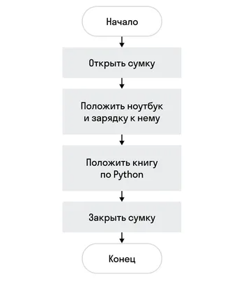
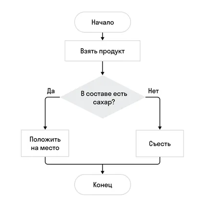
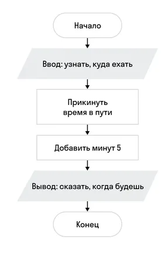
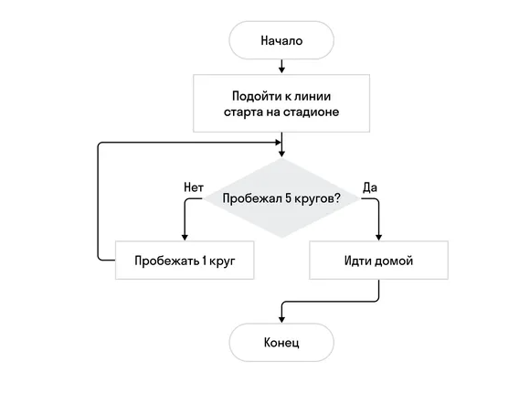

# Алгоритмы  

### Алгоритм — последовательность действий, которая приводит к известному результату.

Алгоритмы — это основа любого языка программирования. Они не меняются со временем.  

### Псевдокод — это упрощенный язык программирования, используемый для иллюстрации алгоритма. Он отличается от обычного кода тем, что написан языком, который понятен человеку.

### Псевдокод — это простой и удобный способ записать идею алгоритма перед тем, как перейти к написанию реального кода.

Цель псевдокода — реализовать решение задачи. Он позволяет абстрагироваться от деталей конкретного языка программирования и сфокусироваться на общей структуре алгоритма.  

### Блок-схема — форма записи любого алгоритма, где каждому шагу соответствует определенный блок.  

## Блоки :  

### Начало и конец

У любого алгоритма есть блоки начала и конца.  
Блок начала и блок конца в алгоритме только один. Изображается ***прямоугольником со скругленными углами***.  

### Действие (последовательность)  

Геометрическая форма блока действия (последовательности) — ***прямоугольник с углами***.  
Если мы видим такой блок, это значит, что нам нужно прочитать, что написано внутри прямоугольника, и сделать это.  

Пример из реальной жизни — чек-лист. Когда мы собираемся в путешествие, у нас есть длинный список того, что нужно сделать. Каждый шаг выполняется всегда и только один раз.

  

### Условие

Блок условия изображается в виде **ромба**. Особенность записи этого блока — это один вход и два выхода.  

Внутри ромба всегда есть вопрос, на который можно ответить «да» или «нет» (true/false). Если ответ «да», то мы движемся по ветке «да». Если ответ «нет» — по ветке «нет».  

Условие подразумевает, что одна ветка будет обязательно исполнена, а вторая нет.

  

### Ввод и вывод

Блоки ввода и вывода изображаются на схеме параллелограммами. 

Ввод и вывод на блок-схеме выглядят одинаково, поэтому обязательно указывайте на схеме, ввод это или вывод.

  

### Циклы

Имеют так же вид ромба с вопросом, из которого может идти несколько веток.

При определенном ответе - вы снова попадаем на тот же вопрос до тех пор, пока не будет выполнено условие.

Важно правильно записывать условия внутри ромба, иначе цикл окажется бесконечным.

 

### Чек-лист при составлении алгоритма

 Проверьте, что есть начало и конец.
 Проверьте, что все действия на месте.
 Проверьте, что у условий и циклов предусмотрены ветки «да» и «нет».
 Мысленно пройдите по всей схеме и убедитесь, что все ветки приходят к концу и нет бесконечных циклов.

