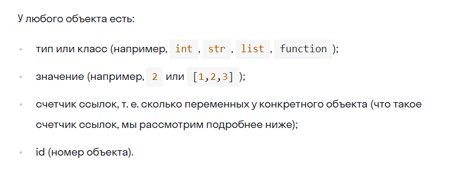
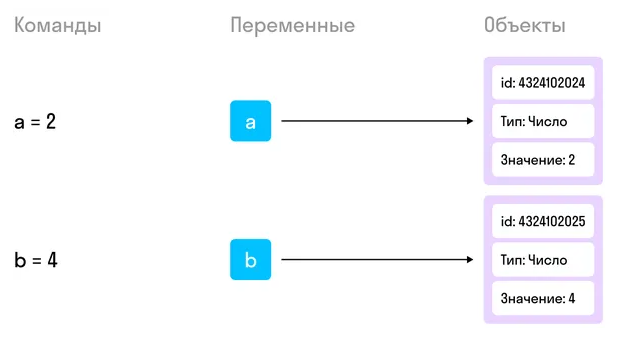
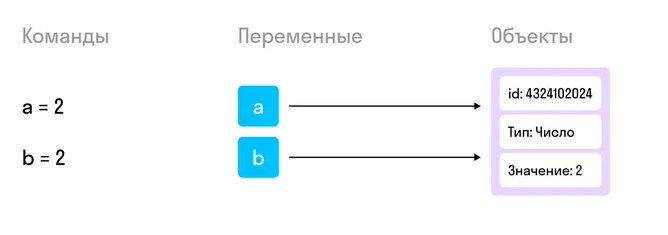
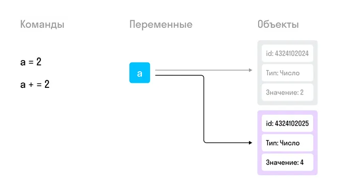
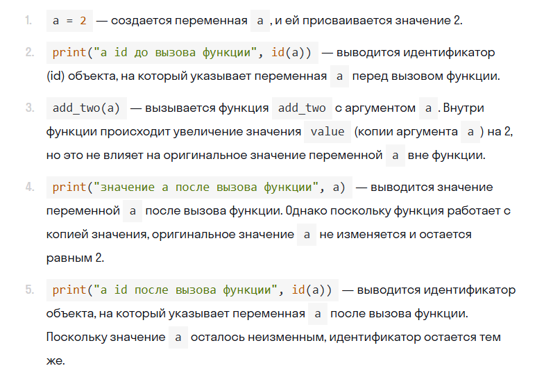
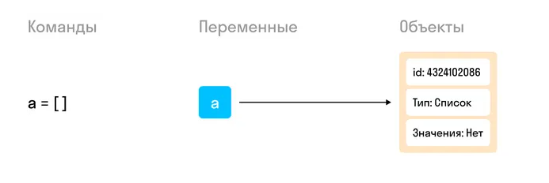
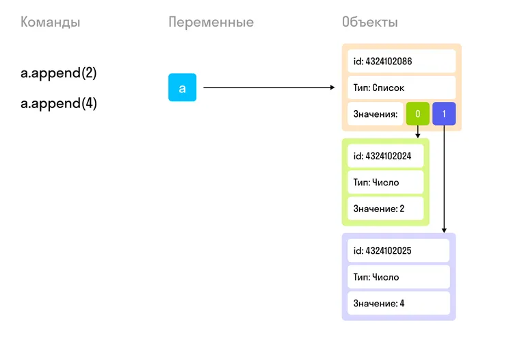
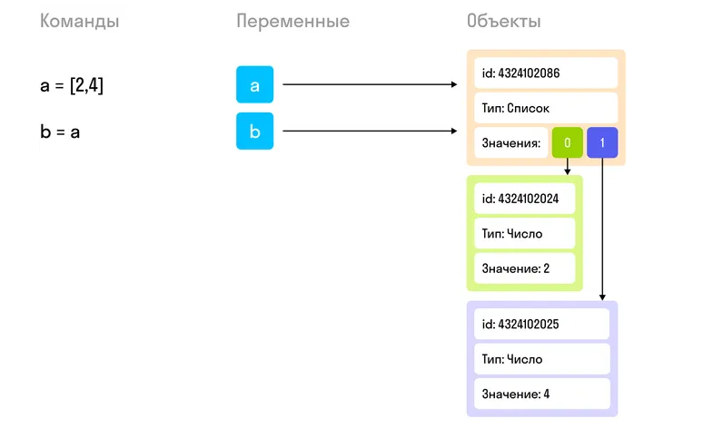

# Объект в Python — это любые данные, которые вы сможете привязать к переменной и у которых есть тип. Это самая высокая абстракция, ведь почти всё в Python — это объекты.

К объектам относятся:

число любого типа;
строка;
список, кортеж или множество;
функция;
экземпляр класса;
класс;
модуль или пакет.

### Операторы и ключевые слова типа if или not привязать нельзя, это не объекты.



### Все объекты в Python имеют свой уникальный идентификатор — id. Идентификатор присваивается объекту при его создании и при каждом запуске программы будет разным.

Чтобы посмотреть id объекта, достаточно вызвать функцию id()
```
print(id(2))
print(id("2"))
print(id([2]))

4376854800
4379287984
4377601152
```

id объекта — это фактически десятичное обозначение физического адреса в памяти. Например, объект с id 4376854800 физически находится по адресу 0x104e18110.



Cоздали две переменные и получили два объекта. Всё просто.


Поскольку два одинаковых объекта с одним типом и одним значением в Python не нужны, Python создает две переменные, привязанные к одному объекту.

```
a = 2
b = 2

print(id(2))
print(id(a))
print(id(b))

4359094544
4359094544
4359094544
```

### Изменение переменных неизменяемых типов


Представим ситуацию: у вас была переменная, и вы поменяли ее значение. У самой переменной значения нет, есть только объект, а вот у него уже есть значение. Значит, если переменной нужно новое значение, то переменная может:

изменить значение объекта,  

найти себе новый объект с нужным значением.

### Неизменяемые (иммутабельные) типы (bool, int, float, str) не меняются, и переменная выбирает себе новый объект. То есть после каждой операции с числовой переменной объект, на который она указывает, будет изменяться.



```
a = 2

print(id(a))
print(id(2))

a += 2

print(id(a))
print(id(4))

# 4349247760
# 4349247760
# 4349247824
# 4349247824
```

### Работа с функциями

Когда мы передаем неизменяемый объект в функцию, в функции оказывается тот же самый объект, но изменения, которые выполняются внутри функции, будут сделаны не с ним, а уже с другим объектом. Это обеспечивает изоляцию области видимости для функции.

**Такая передача называется передачей по значению.**

```python
def add_two(value):
    print("value id до увеличения", id(value))
    value += 2
    print("value id после увеличения",id(value))

a = 2

print("a id до вызова функции", id(a))
add_two(a)
print("значение а после вызова функции", a)
print("a id после вызова функции", id(a))


a id до вызова функции 4336648464
value id до увеличения 4336648464
value id после увеличения 4336648528
значение а после вызова функции 2
a id после вызова функции 4336648464
```


# Что происходит с неиспользуемыми объектами

Представим, что у нас есть программа, которая перебирает числа от 1 до 10 000 и записывает в файл каждое из них. Когда этот перебор заканчивается, в памяти останется 10 000 ненужных объектов, которые не связаны ни с какими переменными.

Это значительный балласт, и скоро такие переменные могут занять всю память и замедлить скорость обработки информации до нуля.

На самом деле Python устроен так, что после выхода из блока (цикла, функции, контекста и т. д.) специальная служебная программа, которую называют «сборщик мусора», удаляет тех, кто остался без пары. «Сборщик мусора» связан со счетчиком ссылок объекта, о котором мы упоминали выше. Чем больше переменных связано с объектом, тем выше счетчик ссылок. Когда переменные перестают существовать (при выходе из цикла или функции) или меняют свой объект, счетчик уменьшается. Когда счетчик достигает нуля, объект удаляется.

# Как устроены изменяемые объекты

Когда мы объявляем переменную типа «список», например ```a = []```, будет создана переменная a, указывающая на объект со значением, равным пустому списку.



Однако при добавлении элемента список будет изменен, но переменная продолжит указывать на тот же самый объект, а вот уже сам объект будет содержать в себе ссылки на новые объекты.



Запустим код и проверим, что объект, на который указывает переменная, не меняется при изменении объекта:
```
a = []

print(id(a))

a.append(2)
print(id(a))

a.append(4)
print(id(a))

4451524608
4451524608
4451524608
```

# Один объект для двух переменных


Обе переменные будут указывать на один и тот же изменяемый объект, значит, применить к объекту первой переменной какие-то действия — это то же самое, что применить такие же действия ко второй переменной.

```
a = [2, 4]
b = a

a.append(6)
print(b)

# Выведет [2, 4, 6]
```
# Поведение изменяемых типов в функциях

Здесь следует сказать, что мы никогда не передаем в функцию переменную. На самом деле мы передаем значение.

```
# Функция добавляет элемент к списку
def add_six(items):
    items.append(6)
    # Посмотрим, с каким объектом связано items
    print("items", id(items))

a = [2, 4]
# Посмотрим, с каким объектом связано а
print("a", id(a))

add_six(a)
# Посмотрим, что в связанном с переменной объекте
print(a)


a 4309131264
items 4309131264
[2, 4, 6]
```

### Как мы видим, при передаче изменяемого типа в функцию мы работаем с одним и тем же объектом. Это называется передачей по ссылке.

## Передача по ссылке — способ передачи данных в функцию (или метод), когда в функции используется тот же самый объект, для которого была вызвана функция.


# Копирование и глубокое копирование

оператор присваивания = создает поверхностную копию исходного списка. То есть если мы изменим элемент в списке reduced_list,исходный список full_list также изменится:

```
full_list = [1,2,3,4]
reduced_list = full_list
reduced_list.remove(4)

print(full_list)
print(reduced_list)

[1, 2, 3]
[1, 2, 3]
```

Теперь то же самое с использованием copy():

```
full_list = [1,2,3,4]
reduced_list = full_list.copy()
reduced_list.remove(4)

print(full_list)
print(reduced_list)


[1, 2, 3, 4]
[1, 2, 3]
```


