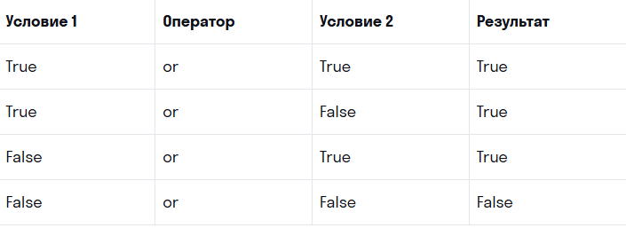

# Оператор if
### Оператор if — оператор ветвления, или условный оператор; запускает код, если условие выполняется. Если условие не выполняется, то ничего не происходит.

### Схематично конструкция с  if записывается так:


```python
if условное_выражение:
    инструкции
    инструкции
    ...
```

if
 — оператор, который вводит условие;
 
:
 (двоеточие) после 
условного_выражения
 сообщает, что дальше будет действие или набор последовательных действий при выполнении условия;
 
инструкции
 — действие с каждым элементом.

 ### Обратите внимание, что все указания после двоеточия идут с отступом в 4 пробела.

 ```python
is_server_on = True 

if is_server_on:
    print("Сервер работает")
```

 ```python
# Исходное состояние
is_light_on = False

# Включить свет, если он выключен
if not is_light_on:
    is_light_on = True
    print("Свет включен")
```

# Операторы сравнения

### Вместо булевых переменных в условных операторах можно использовать операторы сравнения. Они возвращают такие же булевы значения, как мы только что создавали.


 ```python
a = 5    
b = 10

Оператор «больше» (>):

if a > b:
    print("Первое число больше второго")

Оператор «меньше» (<):
if a < b:
    print("Первое число меньше второго ")

Оператор «больше или равно» (>=):
if a >= b:
    print("Первое число больше или равно второго")
    
Оператор «меньше или равно» (<=):
if a <= b:
    print("Первое число меньше или равно второго")

Оператор «равно» (==):
if a == b:
    print("Числа одинаковые")

Оператор «не равно» (!=):
if a != b:
    print("Числа разные")

Оператор in проверяет, есть ли значение а в переменной b, используется для строк:

a = "ошки" 
b = "мошки" 
if a in b:
    print("ошки в мошках")
```

# Оператор if-else

### Оператор if-else — условный оператор, который проверяет, выполняется ли условие после if. Если условие выполняется, то совершается действие, если условие не выполняется, то срабатывает блок else («иначе»).

Схематично конструкция с 
if-else
 записывается так:

 ```python
if условное_выражение:
    инструкции
    инструкции
else:
    инструкции
 ```


# Оператор elif

### Оператор elif(сокращенно от else if) — оператор, который вводит последующие условия. В одной условной конструкции оператор elif может вводиться сколько угодно раз. Он проверяется в том случае, если if не сработал.

 ```python
if a > b: 
    print("Больше")
elif a < b:
    print("Меньше") 
elif a == b:
    print("Равно")
 ```

 Если нужно проверить все исключения из условий 
if/elif
, используется оператор 
else
:
 ```python
if a > b:
    print("Больше")
elif a == b:
    print("Равно")
else:
    print("Меньше")
 ```

 ### Множественные сравнения
 В Python внутри одного условия можно выполнять несколько сравнений.

Например, проверить, лежит ли число в диапазоне от 0 до 100:
 ```python
number = 77  

if 0 <= number <= 100:
    print("число от 0 до 100")
```

# Оператор and
### Когда мы проверяем несколько условий, причем эти условия должны выполняться вместе и одновременно, то используем оператор and («и»).

Программа возвращает 
True,если оба условия — True.


# Оператор or
### Когда мы проверяем несколько условий, причем нам достаточно, чтобы только одно из условий выполнялось, то используем оператор or («или»).

Программа возвращает 
True, если хотя бы одно из условий True.

