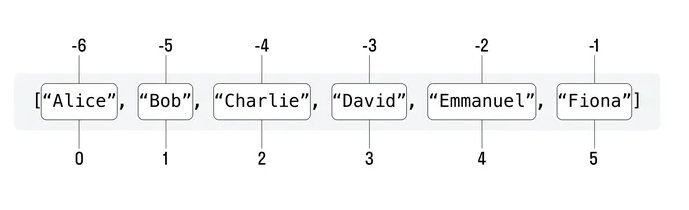

# Список — это тип данных list, представляющий собой упорядоченный набор элементов.

Мы перечисляем эти элементы, и всё это хранится в одной переменной.

Примеры того, как создавать списки:
```python
animals = ["deer", "bear", "rabbit", "butterfly"]
numbers = [5, 4, 3, 2, 1, 0]
flags = [True, True, False, True]
```

### Индексы элементов списка
У каждого элемента списка есть индекс — порядковый номер.

Нумерация элементов начинается с нуля, т. е. индекс первого элемента будет равен 0.

```python
# 0    1    2    3    4    5
['P', 'y', 't', 'h', 'o', 'n']
```

Для обращения к элементу списка по индексу используйте следующий синтаксис:

```
название списка[индекс элемента]
```

### Отрицательные индексы

если мы считаем от начала списка, элементы начинаются с 0, а если с конца — с −1.



# Функция len. 

### Отличие функции от метода


### Функция — самостоятельная единица в Python, которая выполняет какие-то определенные действия.

### Метод — часть другой функциональности Python (например, метод append — часть списков), которая выполняет определенную функцию.

Когда мы говорим «функция», это значит, что она будет вызываться, не привязываясь к какому-то другому объекту, т. е. самостоятельно.

Когда мы говорим «метод», это значит, что он будет вызываться через объект, т. е. через что-то, что записано в переменной или просто является любым типом данных (список, строка, число и т. д.). 

# Функция len

### Функция len — это встроенная функция Python, которая используется для определения количества элементов (длины) списка.

```python
len(list)

len — это функция расчета количества элементов в списке

list — список, количество элементов которого мы будем считать

```

Функция len никак не меняет исходный список, она производит сторонние расчеты, которые нужно записать в переменную для дальнейшего использования, либо использовать ее результат в качестве аргумента для другой функции, например 
print.

### Длина списка и индекс последнего элемента всегда разные и различаются на единицу!

Если длина 5, то индекс последнего элемента 4.


 # Срезы списков

 ### Срез (slice) — это способ выбора части списка на основе индексов элементов. Срезы позволяют извлекать определенный диапазон элементов из списка.

 ```python
Синтаксис среза:

my_list[start:stop]

start — индекс начала среза (включительно)

stop — индекс конца среза (невключительно).
 ```

 Если не указан начальный индекс (start), срез начнется от самого начала списка, т. е. от элемента с индексом 0.

 Если не указан конечный индекс (stop), срез будет идти до самого последнего элемента, включая его.

### Шаг среза

 Шаг определяет, с каким интервалом выбирать элементы из списка.
 
```python
Синтаксис среза с шагом:

my_list[start:stop:step]
```

# Математические операции над списками

### Сложение списков

Операция сложения позволяет объединить два и более списка в один.

При сложении получится новый список, который будет содержать сначала все элементы первого списка, затем все элементы второго списка

```python list_1 = [1, 2, 3]
list_2 = [4, 5, 6]

result = list_1 + list_2
print(result)

>>> [1, 2, 3, 4, 5, 6]
```

### Умножение списка на число
Эта операция позволяет повторить список несколько раз, умножив его на целое число.

```python
list_1 = [1, 2, 3]

result = list_1 * 3
print(result)

>>> [1, 2, 3, 1, 2, 3, 1, 2, 3]
```


# Сортировка списков

### Сортировка списков с помощью метода sort()

Списки в Python имеют встроенный метод sort(), который позволяет сортировать элементы списка на месте, при этом изменяя сам список. Этот метод сортирует список по возрастанию.

my_list = [3, 1, 4, 1, 5, 9, 2, 6, 5, 3, 5]
# Сортируем список по возрастанию
my_list.sort()
print(my_list)

>>> [1, 1, 2, 3, 3, 4, 5, 5, 5, 6, 9]

Метод sort() изменяет исходный список, и результат сортировки сохраняется в том же (сортируемом) списке.

Сортировка по убыванию с помощью метода sort()
Для сортировки списка по убыванию можно использовать аргумент reverse=True:
```python
my_list = [3, 1, 4, 1, 5, 9, 2, 6, 5, 3, 5]
# Сортируем список по убыванию
my_list.sort(reverse=True)
print(my_list)

>>> [9, 6, 5, 5, 5, 4, 3, 3, 2, 1, 1]
```

# Создание отсортированной копии списка с помощью функции sorted()

### Функция sorted() позволяет создать отсортированную копию списка, не изменяя исходный список. Эта функция может быть использована для сортировки списка по возрастанию или убыванию.

Пример создания отсортированной копии списка:

my_list = [3, 1, 4, 1, 5, 9, 2, 6, 5, 3, 5]
# Создаем отсортированную копию списка
```python
sorted_list = sorted(my_list)

print(sorted_list)
>>> [1, 1, 2, 3, 3, 4, 5, 5, 5, 6, 9]

# Исходный список остается неизменным
print(my_list)
  
>>> [3, 1, 4, 1, 5, 9, 2, 6, 5, 3, 5]
```

Сортировка по убыванию с помощью функции sorted()
Для сортировки списка по убыванию с использованием функции sorted() можно воспользоваться аргументом 
reverse=True:
```python

my_list = [3, 1, 4, 1, 5, 9, 2, 6, 5, 3, 5]
# Создаем отсортированную по убыванию копию списка
sorted_list = sorted(my_list, reverse=True)

print(sorted_list)
>>> [9, 6, 5, 5, 5, 4, 3, 3, 2, 1, 1]

# Исходный список остается неизменным
print(my_list)  
>>> [3, 1, 4, 1, 5, 9, 2, 6, 5, 3, 5]
```
