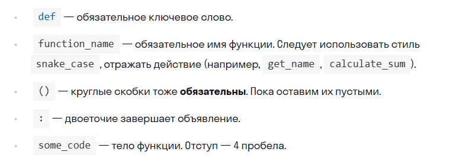
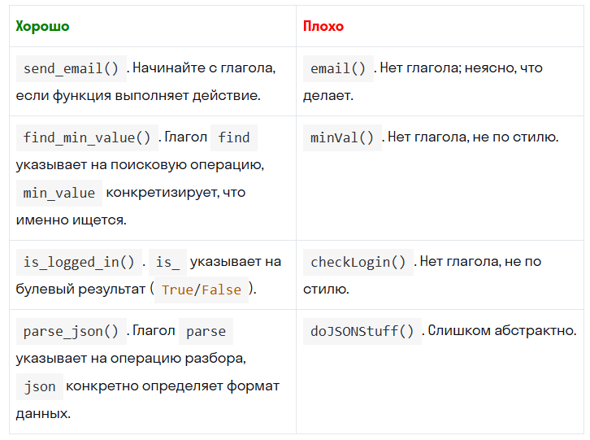

# Функция — это участок кода с именем, который выполняет определенную задачу и может быть вызван из любой части программы.

### Функции помогают организовать код: делают его чище, модульнее и проще для повторного использования.

# Зачем нужны функции

### Повторное использование

Главное преимущество функций — возможность использовать код повторно. Один раз написали — и можете вызывать сколько угодно.

### Короткий и понятный код

Если сложные части кода вынесены в функции, основная программа становится короче, а читать ее легче. 

Функции превращают длинные фрагменты кода в короткие, понятные и переиспользуемые шаги.

### Модульность и тестирование

Если ваше приложение взаимодействует с пользователем, вам придется запускать его снова и снова, чтобы всё проверить. Но функции можно тестировать по одной, передавая разные параметры. Это экономит время и делает код устойчивее.

# Как создать функцию

### Процесс создания функции называется объявлением. В Python это делается с помощью ключевого слова def.

```python
def function_name():
  some_code

def hello_world():
  print("Привет, мир!")
```



# Как правильно называть функции



# Как вызвать функцию

### Созданная функция сама по себе не выполняется. Нужно вызвать ее по имени с круглыми скобками:

```python
def hello_world():
  print("Привет, мир!")

hello_world()
```
Без скобок мы получаем сам объект функции, а не результат ее работы.

# Параметры функций

### Параметры — это переменные, которые функция ожидает получить при вызове. Они указываются в скобках при объявлении функции.

### Аргументы — это конкретные значения, которые мы передаем функции при вызове.

```python
def hello_someone(name, age):
  print(f"Привет, {name}! Тебе {age} лет!")
```
Здесь name и age — параметры функции. Мы используем их внутри функции как обычные переменные.  
 При вызове функции:

 ```python
 hello_someone("Олег", 25)
```

Строка "Олег" и число 25 — это аргументы. Они подставляются вместо параметров, и функция выполняет свои действия.

### Итак: параметры задаются в определении функции, а аргументы передаются при вызове.

# Возврат значения из функции

### Функции с возвратом значений становятся универсальными строительными блоками, которые можно комбинировать по-разному, делая код более гибким и модульным.

- чтобы сохранить результат для последующего использования;  

- для передачи данных в другие функции;  

- чтобы продолжить обработку информации в основном коде.  

### Для этого используется ключевое слово return. Если функция ничего не возвращает явно, Python всё равно вернет специальное значение None

```python
def hello_someone(name, age):
  print(f"Привет, {name}! Тебе {age} лет!")

text = hello_someone("Олег", 25)
print(text)

Результат:

Привет, Олег! Тебе 25 лет!
None
```

### В консоли мы видим строку от print() внутри функции, а потом — None, потому что функция не содержит return. Чтобы вернуть строку из функции, используем return:
```python
def make_hello_someone(name, age):
  return f"Привет, {name}! Тебе {age} лет!"

result = make_hello_someone("Олег", 25)
print(result)

Результат:

Привет, Олег! Тебе 25 лет!
```
Теперь функция возвращает строку, а не просто печатает ее. Это удобно, если мы хотим сохранить результат, передать его другой функции или обработать дальше.


