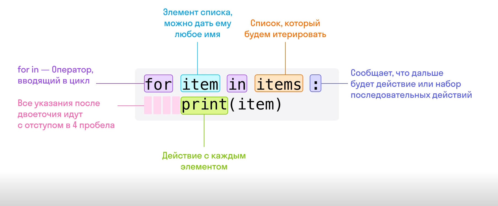
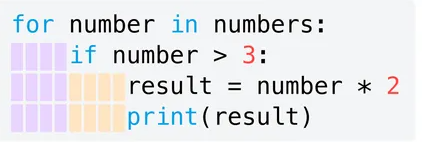

# Цикл for



### Циклы — это важная концепция в программировании, которая позволяет выполнять один и тот же блок кода многократно.


**Цикл for** в Python используется для выполнения одного и того же блока кода для каждого элемента в некоторой последовательности. Последовательность может быть списком, строкой и так далее.


Рассмотрим пример базовой структуры цикла 
for:
```
for element in sequence:
    # Тело цикла — блок кода, 
    # который будет выполнен для каждого элемента
```

Где:

for — ключевое слово, обозначающее цикл;  
element — элемент (иногда называют временной переменной), который будет изменяться в ходе прохождения объектов циклично, т. е. по очереди от 1-го до последнего элемента объекта;  
in sequence — указатель на то, из какого объекта брать элементы и обходить циклом;
: — в конце строки с определением цикла должно стоять двоеточие   
: Это говорит интерпретатору, что мы закончили определение цикла и можем зайти в его тело.
Чтобы работать с циклами, введем новое понятие — итерация.

### Итерация — это выполнение набора инструкций определенное количество раз, а также обход элементов набора данных.


Пример 1. Итерация по списку

Допустим, у нас есть список чисел, и мы хотим вывести каждое число, умноженное на 2:
```
numbers = [1, 2, 3, 4, 5]
for number in numbers:
    result = number * 2
    print(result)

Выведет:

2
4
6
8
10
```
В этом примере цикл for перебирает каждый элементсписка 
numbers, и для каждого элемента выполняется блок кода внутри цикла. Результатом будет вывод умноженных на 2 чисел.


# Цикл for с условием

Мы можем использовать условный оператор if внутри цикла for.

Пример:
```
numbers = [1, 2, 3, 4, 5]
for number in numbers:
    if number > 3:
        result = number * 2
        print(result)

Выведет:

8
10
```
В этом случае перед умножением на 2 мы проверяем, больше ли текущее число, чем 3. Если условие выполняется, то выполняется блок кода с умножением и выводом результата.


### Важно правильно соблюдать отступы, чтобы не возникло ошибок при выполнении программы



### Цикл for с переменной-счетчиком

Переменная-счетчик — это переменная, в которой хранится число, ее можно увеличивать или уменьшать в зависимости от определенных условий. Например, если элемент в списке найден, увеличиваем переменную-счетчик на 1.

Основные шаги работы цикла 
for
 с переменной-счетчиком:

**Инициализация** переменной-счетчика. Объявляется переменная, которая будет использоваться как счетчик и инициализируется начальным значением.

**Создание цикла for**. 
Создается цикл for, который будет выполняться определенное количество раз. Внутри этого цикла можно использовать переменную-счетчик.

**Итерация**. На каждой итерации цикла значение переменной-счетчика изменяется, и код внутри цикла выполняется с новым значением счетчика.

**Завершение цикла**. Цикл завершается, когда счетчик достигает определенного условия (например, определенного значения) или выполняется определенное количество итераций.

Пример 1. Использование переменной-счетчика для итерации по списку
```
numbers = [1, 2, 3, 4, 5]
# Инициализируем переменную-счетчик
total = 0

for num in numbers:
# На каждой итерации суммируем элемент списка с переменной-счетчиком
    total += num

# Выводим сумму всех элементов списка
print(total)

>>> 15
```

Пример 2. Использование переменной-счетчика для определения количества итераций

```
numbers = [10, 20, 30, 40, 50]
# Инициализируем переменную-счетчик
count = 0

for num in numbers:
# На каждой итерации увеличиваем счетчик на 1
    count += 1  

print("Количество элементов в списке:", count)

>>> Количество элементов в списке: 5
```