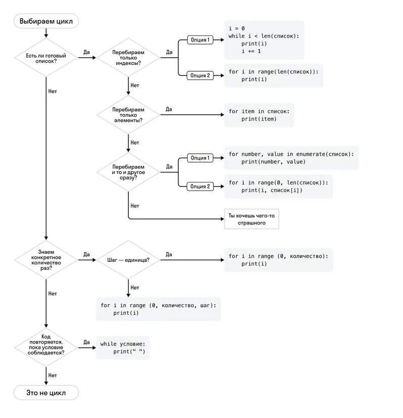

# Цикл while

### Цикл while — это один из ключевых инструментов, который позволяет выполнять набор инструкций многократно до тех пор, пока определенное условие остается истинным.

Этот цикл применяется, когда вы не знаете заранее, сколько раз вам нужно выполнить какое-то действие.

```python
while условие:
    # Тело цикла
    # Этот блок кода выполняется, пока условие верно
```

while — ключевое слово, которое начинает объявление цикла;

условие — это логическое выражение, которое проверяется перед каждой итерацией цикла. Если условие истинно, цикл выполняется. Если ложно, цикл завершается;

тело цикла — это блок инструкций, которые будут выполняться, пока условие цикла верно. Тело цикла записывается с 4 пробелами отступа, как цикл 
for или условие.

Пример 1. Подсчет до определенного числа

```
count = 1
while count <= 5:
    print(count)
    count += 1

Выведет:

1
2
3
4
5
```

Пример 2. Запрос пользователя

```
user_input = input()
while user_input != "exit":
    user_input = input("Введите 'exit', чтобы выйти: ")
```

### Циклы while True. Бесконечное выполнение и выход с помощью break

Цикл while True — это инструмент, который позволяет создавать бесконечные циклы, то есть такие циклы, которые будут выполняться до тех пор, пока вы явно не прервете их с помощью оператора 
break.

```
while True:
    # Тело бесконечного цикла
    # Будет выполняться бесконечно, пока не будет завершен (прерван)
    # т. е. пока не выполнится условие остановки и не будет вызван оператор break
```

### Оператор break в циклах

Оператор 
break
 — это оператор, который позволяет прервать выполнение цикла при определенных условиях. Это особенно полезно, когда вы хотите досрочно завершить цикл, т. е. до того, как цикл должен завершиться в обычных условиях.

 Случаи, когда необходимо использовать оператор break:

- Завершение цикла на основе условия. Вы можете использовать 
break, чтобы завершить цикл, когда выполнено определенное условие, даже если условие 
while всё еще верно. Это полезно, когда вы хотите выйти из цикла при определенных событиях или условиях.

- Защита от бесконечных циклов. Оператор break — это хороший способ защитить вашу программу от бесконечных циклов. Вы можете установить условия выхода из цикла, чтобы избежать его зацикливания.

```
Пример 1. Бесконечный ввод с выходом

while True:
    user_input = input("Введите 'exit', чтобы выйти: ")
    if user_input == 'exit':
        break
    print("Вы ввели:", user_input)
```

```
Пример 2. Защита от бесконечного выполнения

count = 0
while True:
    count += 1
    if count > 10:
        break
    print("Итерация номер", count)
```

```
Пример использования оператора break в циклах for
Поиск элемента в списке:

numbers = [1, 2, 3, 4, 5, 6]
target = 4

for num in numbers:
    if num == target:
        print("Элемент найден!")
        break
```

# Оператор continue

### Оператор continue — это средство, которое помогает управлять выполнением циклов. Оператор позволяет пропустить текущую итерацию цикла и перейти к следующей.

Оператор используется в тех случаях, когда вы хотите пропустить часть кода при выполнении цикла, но не завершать его полностью.

```
while условие:
    # Блок кода
    if условие_пропуска:
        continue
    # Остальной код в цикле
```

while — ключевое слово, которое начинает объявление цикла;

условие — это логическое выражение, которое проверяется перед каждой итерацией цикла. Если оно истинно, цикл выполняется. Если ложно, цикл завершается;

условие_пропуска — это другое логическое выражение, которое, если истинно, приводит к выполнению оператора 
continue. В случае, если 
условие_пропуска не будет выполнено, выполнится остальной код в цикле;

continue — это оператор, который пропускает оставшуюся часть текущей итерации цикла и возвращает программу к следующей итерации цикла 
while.


Случаи, когда необходимо использовать 
continue:

- Пропуск некоторых итераций. Используйте 
continue, когда вам нужно пропустить выполнение части кода внутри цикла на определенной итерации, но при этом корректно отработать цикл в других итерациях. То есть если необходимо исключить один или несколько элементов из обработки циклом.

- Фильтрация данных. Вы можете использовать 
continue, чтобы фильтровать данные и выбирать только те элементы, которые соответствуют вашим критериям.

```
Примеры использования оператора continue
Пример 1. Пропуск нечетных чисел

count = 0
while count < 5:
    count += 1
    if count % 2 == 1:
        continue
    print("Это четное число:", count)
```

```
Пример 2. Пропуск элементов в списке при поиске

numbers = [1, 2, 3, 4, 5, 6, 7, 8, 9, 10]
target = 5

for num in numbers:
    if num == target:
        continue
    print("Элемент:", num)
```

# Как выбрать цикл

### Цикл for

- Используется для итерации по последовательности (например, списку или строке), а также по другим объектам, которые поддерживают итерацию. С ними вы познакомитесь позже в курсе.

- Оператор for автоматически управляет итерацией, перебирая элементы последовательности.

- Чаще всего используется, когда заранее известно, сколько раз нужно выполнить цикл, и когда вы хотите перебирать элементы последовательности поочередно.

### Цикл while
- Используется, когда неизвестно заранее, сколько раз нужно выполнить цикл, и цикл будет выполняться до тех пор, пока условие истинно.

- Условие проверяется перед каждой итерацией, и цикл будет продолжаться, пока условие верно.

- Цикл while позволяет более гибко управлять повторением операций.

