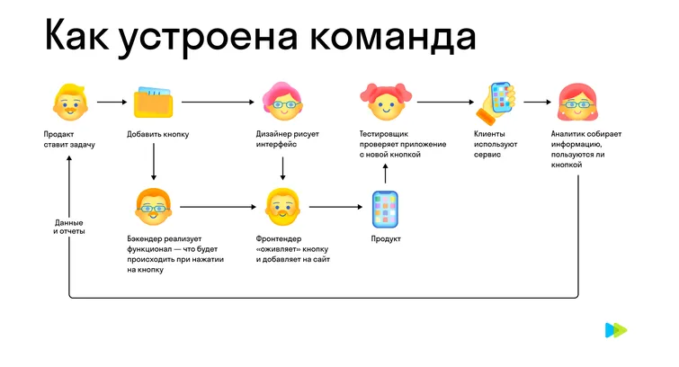
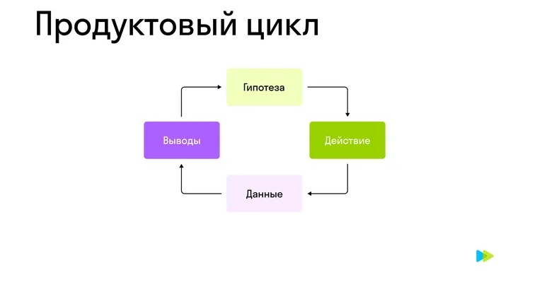

# Введение в профессию
## Как устроена продуктовая команда  
У каждого — своя роль:

- Продакт руководит командой;
- Дизайнер отвечает за оформление продукта;
- Фронтендер и бэкендер пишут код;
- Тестировщик проверяет, как продукт работает;
- Аналитик собирает и обрабатывает данные о продукте.   

## Как выстраивается работа :  
1)**Продакт** ставит задачу команде.    
Продакт (менеджер продукта) — руководитель команды.  

2)Когда появилась задача, в работу подключается **дизайнер**.  
Дизайнер — специалист, который занимается визуальным воплощением объектов.   
Он проектирует интерфейсы и задает их оформление. Отвечает за привлекательность и удобство клиентских интерфейсов, делает всё современным и удобным. Рисует прототипы и макеты, поддерживает всё в одном стиле. Проводит UX-тестирование: проверяет, удобен и понятен ли интерфейс целевой аудитории.   

3)После того как дизайнер нарисует кнопку, работа переходит к **фронтендеру**.  
Фронтендер (фронтенд-разработчик) — специалист, который создает ту часть сайта или приложения, которую видят пользователи — пользовательский интерфейс.  
Превращает дизайн в настоящие страницы, а страницы делает интерактивными. Всё, что мы видим и нажимаем на сайте или в приложении, — это фронтенд. Все данные фронтендер получает с сервера, поэтому он главный напарник бэкендера в проекте.  

4)Далее работа переходит Бэкендеру.  
Бэкендер — это я.  
Бэкендер (бэкенд-разработчик) — специалист, который отвечает за внутреннюю логику работы продукта.  
Бэкендер пишет серверную часть, реализует функционал, работает с базами данных, настраивает сервер и пользуется специальными программами для разработки. Вместе с фронтендером делаете всю работу, которую увидит пользователь.  

5)Ещё может быть фулстэк разработчик.  
Фулстек (фулстек-разработчик) — специалист, который отвечает за все этапы разработки: как фронтенда, так и бэкенда.  
Делает сложный проект своими руками и лучше понимает процессы. В маленькой компании может быть один или несколько фулстек-разработчиков, в больших компаниях трудятся десятки и даже сотни разработчиков, объединенных в команды, где каждый занят своей группой задач или частью проекта.  

6)После того как свою работу сделали фронтендер и бэкендер, в работу вступает тестировщик.  
Тестировщик, или QA-инженер, — специалист, который проверяет работу продукта.  
Пишет сценарии тестирования, проверяет, работает ли приложение, можно ли его сломать перед отправкой пользователям, ищет баги.  

7)Продукт готов, им пользуются, но работа продуктовой команды продолжается. Собираются данные о продукте, которые передаются аналитику.  
Аналитик данных — специалист, который собирает, обрабатывает и анализирует данные о продукте.  
Аналитик готовит отчеты и приносит команде аргументированные ответы: что работает, что повысило продажи или заявки, что пользователи стали использовать чаще, а что даже не заметили.  

### Вся работа с продуктом замыкается на продакте: от продакта команда получает задачу, к продакту приходит обратная связь после того, как все сделали свою работу.  

# Разработка цифровых продуктов

### При работе над продуктом цифровые компании разбивают рабочий процесс на короткие временные промежутки — спринты. Команда начинает разработку с самой маленькой, быстрой и дешевой версии продукта, тестирует ее и оценивает. Такой подход называется agile.

Подход agile — итеративный подход в разработке программного продукта.  

Введение в профессию
9. Конспект
9 из 9
Конспект поможет вам вспомнить информацию, которая была в видеоуроке, пригодится для дальнейшего обучения и работы.

Как устроена продуктовая команда
Современная команда состоит из нескольких участников.

У каждого — своя роль:

продакт руководит командой;
дизайнер отвечает за оформление продукта;
фронтендер и бэкендер пишут код;
тестировщик проверяет, как продукт работает;
аналитик собирает и обрабатывает данные о продукте.
Рассмотрим работу продуктовой команды на схеме:

Продакт ставит задачу команде. Например, как в видеоуроке, добавить кнопку в приложение.
Продакт (менеджер продукта) — руководитель команды.

Когда появилась задача, в работу подключается дизайнер.
Дизайнер — специалист, который занимается визуальным воплощением объектов.

Он проектирует интерфейсы и задает их оформление. Отвечает за привлекательность и удобство клиентских интерфейсов, делает всё современным и удобным. Рисует прототипы и макеты, поддерживает всё в одном стиле. Проводит UX-тестирование: проверяет, удобен и понятен ли интерфейс целевой аудитории.

После того как дизайнер нарисует кнопку, работа переходит к фронтендеру.
Фронтендер (фронтенд-разработчик) — специалист, который создает ту часть сайта или приложения, которую видят пользователи — пользовательский интерфейс.

Превращает дизайн в настоящие страницы, а страницы делает интерактивными. Всё, что мы видим и нажимаем на сайте или в приложении, — это фронтенд. Все данные фронтендер получает с сервера, поэтому он главный напарник бэкендера в проекте.

 Бэкендер — это вы.
Бэкендер (бэкенд-разработчик) — специалист, который отвечает за внутреннюю логику работы продукта.

Бэкендер пишет серверную часть, реализует функционал, работает с базами данных, настраивает сервер и пользуется специальными программами для разработки. Вместе с фронтендером делаете всю работу, которую увидит пользователь.

У хорошего бэкендера чистый, документированный код, быстро работающий сервер.

Еще один специалист, который может быть в команде, — фулстек.
Фулстек (фулстек-разработчик) — специалист, который отвечает за все этапы разработки: как фронтенда, так и бэкенда.

Делает сложный проект своими руками и лучше понимает процессы. В маленькой компании может быть один или несколько фулстек-разработчиков, в больших компаниях трудятся десятки и даже сотни разработчиков, объединенных в команды, где каждый занят своей группой задач или частью проекта.

После того как свою работу сделали фронтендер и бэкендер, в работу вступает тестировщик.
Тестировщик, или QA-инженер, — специалист, который проверяет работу продукта.

Пишет сценарии тестирования, проверяет, работает ли приложение, можно ли его сломать перед отправкой пользователям, ищет баги.

 

Что такое баг
 

Продукт готов, им пользуются, но работа продуктовой команды продолжается. Собираются данные о продукте, которые передаются аналитику.
Аналитик данных — специалист, который собирает, обрабатывает и анализирует данные о продукте.

Аналитик готовит отчеты и приносит команде аргументированные ответы: что работает, что повысило продажи или заявки, что пользователи стали использовать чаще, а что даже не заметили.

Вся работа с продуктом замыкается на продакте: от продакта команда получает задачу, к продакту приходит обратная связь после того, как все сделали свою работу.

В этой схеме могут быть отступления:

В одной команде бывает несколько бэкенд- и фронтенд-разработчиков.
Если продукт простой и достаточно фронтендера, то в команде обходятся без дизайнера.
Вместо фронтендера и бэкендера может быть фулстек-разработчик.
Если продукт несложный и каждый специалист тестирует свой продукт, в команде может не быть тестировщика.
Разработка цифровых продуктов
При работе над продуктом цифровые компании разбивают рабочий процесс на короткие временные промежутки — спринты. Команда начинает разработку с самой маленькой, быстрой и дешевой версии продукта, тестирует ее и оценивает. Такой подход называется agile.

Подход agile — итеративный подход в разработке программного продукта.

Этот подход делится на следующие этапы:

- Зарождается идея продукта.  
- Формируется бэклог для спринта.  
Сформировать бэклог для спринта — значит выбрать и организовать задачи, которые нужно выполнить за определенный период времени, обычно это 1-2 недели. 

- После того как бэклог сформировался, выполняется работа в спринте.  
-Это подход к организации работы, при котором на 1, 2 или 4 недели выбирают задачи, распределяют их, делают и сдают. При таком подходе большие задачи обычно разбивают на несколько спринтов.  
-Работа короткими спринтами позволяет не менять приоритеты задач внутри спринта, быстрее выдавать результат и постоянно тренировать оценку сроков.
- Когда работа выполнена, продукт отправляется в релиз.  
-Результаты работы анализируются, тестируются.  
-На основе полученных результатов формируется новый бэклог — запускается новый цикл работы над продуктом.  

### Продуктовый цикл (или HADI-цикл) — подход к работе над продуктом, который состоит из четырех блоков: формирование гипотезы (hypothesis), ее проверка (action), получение измеряемого результата (data) и выводы (insights), на основании которых формулируются дальнейшие гипотезы.

  

С помощью подхода agile компании создают продукт с минимальными затратами и учитывают отзывы клиентов. Поэтому в первую очередь выпускается MVP.  

### MVP (minimum viable product — минимально жизнеспособный продукт) — самая простая версия продукта (сервиса), которая не стоит много ресурсов, но уже полезна пользователям, и мы можем проверить нужность продукта.

