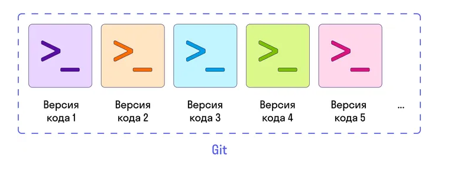

### Git — это распределенная система управления версиями, которая используется для отслеживания изменений в исходном коде и координации работы над проектами между разными разработчиками.

Основное назначение Git — это обеспечение эффективного сотрудничества при разработке ПО, отслеживание истории изменений и управление версиями кода. Даже если разработка ведется не в команде, а в одиночку, важно уметь пользоваться инструментом контроля версий, так как это упростит управление проектами и их состояниями, позволит быстро вернуться к необходимой версии кода.

### Рассмотрим, чем Git будет вам полезен:

- Управление версиями. Git позволяет отслеживать каждое изменение в коде и создавать версии проекта на разные моменты времени. Это облегчает восстановление предыдущих версий, сравнение изменений и откат (возврат) к предыдущим состояниям проекта.
- Коллаборация. Git дает возможность нескольким разработчикам работать над одним проектом одновременно. Он управляет слиянием изменений, что позволяет избежать конфликтов и облегчает совместную работу.
- Ветвление. С Git можно создавать ветки. Это позволяет разрабатывать новые функции или исправлять ошибки независимо от основного кода.
- История изменений. Git хранит историю каждого изменения, включая автора, дату и описание. Это полезно для отслеживания информации о том, кто и что внес в проект.
- Безопасность данных. Используя Git, вы можете хранить удаленные копии своего кода на платформах хостинга, таких как GitHub, GitLab или Bitbucket. Это обеспечивает резервное копирование и защиту данных.

