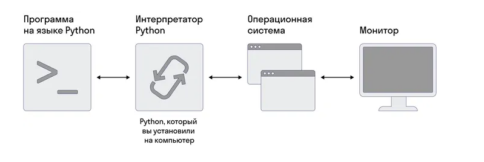

# Python
### Python — это высокоуровневый интерпретируемый язык программирования, который широко используется для разработки веб-приложений, научных исследований, анализа данных, автоматизации задач, создания игр и многого другого.

### Интерпретатор Python — это программа, которая выполняет код, написанный на языке программирования Python. Интерпретатор читает и анализирует написанный код построчно и мгновенно выполняет его на компьютере.

### Установка интерпретатора Python на компьютер позволяет:

### Запускать программы
Вы можете написать программу на языке Python, сохранить ее в файле с расширением .py и запустить ее через интерпретатор. Интерпретатор читает файл, построчно интерпретирует код и выполняет указанные операции.

### Работать с модулями и библиотеками
Множество библиотек и модулей доступны для Python (более подробно об этом мы поговорим в следующих уроках), и установка интерпретатора дает вам доступ к этим ресурсам. Вы можете использовать библиотеки для решения различных задач.

