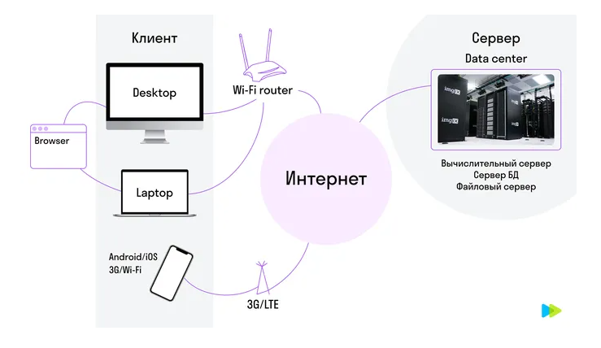

# Как работают сайты и приложения. Клиент-сервер

### Мы выходим в интернет с помощью разных устройств — персонального компьютера (desktop), ноутбука (laptop), гаджетов (смартфоны, планшеты).  
  

Для этого мы открываем браузер на компьютере или ноутбуке, на смартфоне — браузер или мобильное приложение.

### Браузер (Chrome, Firefox, Safari) — это программа на компьютере или смартфоне, которая предлагает строку поиска, избранное, закладки, историю.  

Введем еще одно важное понятие:  

### Клиент-серверная архитектура — это отношения, в которых одна программа — клиент — делает запросы, а другая — сервер — принимает и обрабатывает их.

Браузер в клиент-серверной архитектуре — это клиент, т. е. программа, которая отправляет запросы серверу, получает ответ и взаимодействует с пользователем.

### Клиенты — это:

браузер (Chrome, Safari, Firefox, Opera) на компьютере,  
мобильные приложения,  
многопользовательская игра на игровой консоли,  
банковская программа на терминале оплаты,  
камера наблюдения.  

Чтобы соединиться с интернетом, компьютеры и ноутбуки подключаются к роутеру по кабелю или через сеть Wi-Fi. Мобильные устройства — через Wi-Fi-роутеры или через сети сотовых операторов.

После того как пользователь открыл сайт, браузер отправляет запрос на сервер, получает ответ и превращает полученный исходный код в картинку сайта.

### Сервер — программа, запущенная на мощном компьютере, которая принимает и обрабатывает запросы.

Сервер не общается с пользователями, только с другими компьютерами и администраторами. Компьютеры-серверы находятся в дата-центрах. Они хранят данные, проводят вычисления или обрабатывают запросы.

Рассмотрим, как это работает.  
Вы регистрируетесь в социальной сети, вводите персональные данные. Это всё отправляется в интернет, в дата-центр и сохраняется в базе данных.  
Если вы добавляете видео со своего телефона, то всё это заливается в файловое хранилище. Это дает дополнительные возможности: вы можете зарегистрироваться в соцсети на компьютере, а затем зайти под своим логином и паролем в эту соцсеть с мобильного телефона.  

### Фронтенд и бэкенд
В продуктовой команде есть фронтенд- и бэкенд-разработчики. Простыми словами, фронтенд — это то, что ближе к нам, на клиенте, а бэкенд — подальше, на сервере.

### Фронтенд — это всё, что видит пользователь и с чем он взаимодействует в браузере.

Код фронтенда может быть написан на HTML(язык разметки), CSS(язык стилей) или JavaScript(язык программирования). Фронтенд запускается на клиенте.  

### Бэкенд — это внутренняя часть продукта, то, что скрыто от пользователя.  

Код бэкенда может быть написан на Python, PHP, Java, Go, JavaScript. Бэкенд работает на сервере.

